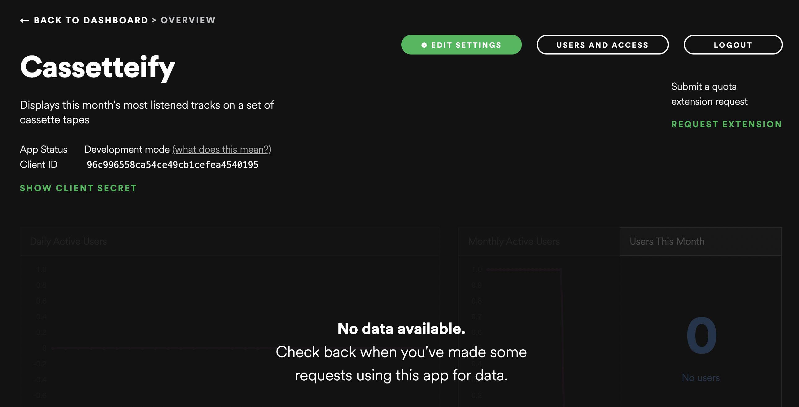
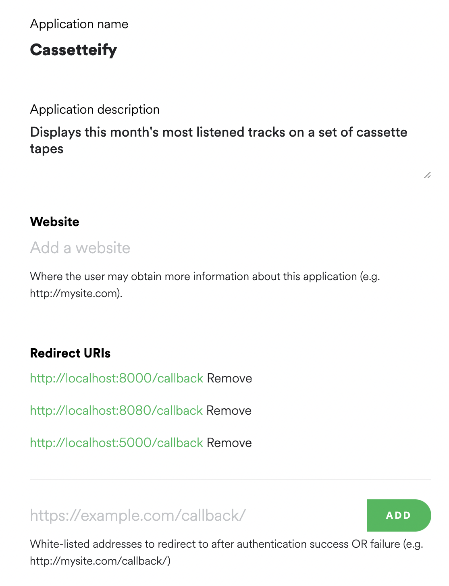

# Using the Spotify API

*August 10, 2022*

Kappa Theta Pi Technical Development

with Neha Desaraju

---

## Let's code an app! <!-- .element: class="r-fit-text" -->

---

## Agenda

1. Getting started
2. Intro to Flask
3. Intro to the Spotify API
4. Putting it all together

---

## Getting started

1. Go to [this template](https://github.com/texaskappathetapi/spotify-api-demo) on Github and click **Use this template** to copy it into your own Github account.
2. Copy the link in your own Github account and type `git clone <repo link>` in your command line.
3. Make sure you have Python and the packages downloaded:
```shell [|1|2]
which python
pip install flask spotipy dotenv os
```

--

## Getting started

1. Go to the [Spotify Developer Dashboard](https://developer.spotify.com/dashboard/) and log in with your Spotify account.
2. Click **Create an app** and fill out the information until you reach this screen:



--

## Getting started

Create a file called `.env` in your cloned repo. It should look like this:

```text
CLIENT_ID=<id>
CLIENT_SECRET=<secret>
```

You can find your `CLIENT_ID` on the app page in the dashboard and your `CLIENT_SECRET` by clicking **Show client secret**.

---

## Flask <!-- .element: class="r-fit-text" -->

--

Open `app.py`:

```python [1-3|5|7-10|18-19]
import spotipy
from spotipy.oauth2 import SpotifyOAuth
from flask import Flask

app = Flask(__name__)

@app.route('/')
def index():
    # return your index.html here!
    pass

@app.route("/auth")
def authorize():
    # return your auth URL here!
    pass


if __name__ == '__main__':
    app.run(host="localhost", port="8000", debug=True)
```

--

Run your app by typing

```shell
flask run
```

into the terminal, and navigate to the URL it displays (typically **https://localhost:8000**).

--

Now we'll create our first route.

```python
@app.route('/hello')
def hello_world():
    return "Hello world!"
```

Go to **https://localhost:8000/hello**! You should see **Hello world!** at the top of the screen.

--

You can also return an `html` file instead of just text. Let's change our index route to display our home page.

```python [1|3-5]
from flask import Flask, render_template

@app.route('/')
def index():
    return render_template('index.html')
```

`index.html` must be in a folder called *templates* for it to work.

--

To link a stylesheet, we have to use Jinja templating syntax. We can use it to replace data programmatically (hence the html files become templates).

```html [|6]
<!DOCTYPE html>
<html lang="en">
<head>
    <meta charset="UTF-8">
    <title>Your Top Artists</title>
    <link rel= "stylesheet" type= "text/css" href= "{{ url_for('static',filename='styles/main.css') }}">
</head>
<body>
    <h1>Cassetteify</h1>
    <p>Get your monthly top artists</p>
    <a href="/auth">Authorize with Spotify</a>
</body>
</html>
```

---

## Spotify API <!-- .element: class="r-fit-text" -->

--

Spotipy is a wrapper that simplifies using the official Spotify API.

1. Add global vars
2. Instantiate auth client (we'll be accessing user info, which requires them to authenticate)
3. Instantiate main Spotipy class

--

```python [|7-10|12|13]
import spotipy
from spotipy.oauth2 import SpotifyOAuth
from flask import Flask, redirect, jsonify, request, render_template
import os
from dotenv import load_dotenv

SPOTIPY_CLIENT_ID=os.getenv('CLIENT_ID')
SPOTIPY_CLIENT_SECRET=os.getenv('CLIENT_SECRET')
SPOTIPY_REDIRECT_URI="http://localhost:8000/callback"
SCOPE="user-top-read user-read-recently-played"

auth = SpotifyOAuth(client_id=SPOTIPY_CLIENT_ID, client_secret=SPOTIPY_CLIENT_SECRET, redirect_uri=SPOTIPY_REDIRECT_URI, scope=SCOPE)
sp = spotipy.Spotify(auth_manager=auth)
```

--

Go to **Edit settings** in your app's Spotify dashboard and add the callback URL to the whitelist.



--

Now we need to actually prompt the user to authenticate.


```python
@app.route("/auth")
def authorize():
    return redirect(auth.get_authorize_url())

@app.route('/callback')
def callback():
    code = auth.parse_response_code(request.url)
    token_query = auth.get_access_token(code=code, check_cache=False)
    return "Authentication success!"
```

--

Let's get some user data. We're interested in the [user's top artists](https://spotipy.readthedocs.io/en/master/?highlight=current_user_top_artists#spotipy.client.Spotify.current_user_top_artists).

```python [|3|10|]
def callback()
    # ... previous code ...
    return redirect("/top_artists")

@app.route("/top_artists")
def top_artists():
    token_info = auth.get_cached_token()
    token = token_info['access_token']
    sp = spotipy.client.Spotify(auth=token)
    top_artists = sp.current_user_top_artists(limit=10, time_range='short_term')
    return top_artists
```

--

Open the `/top_artists` route and you'll see a JSON output like

```json
"items": [
    {
      "external_urls": {
        "spotify": "https://open.spotify.com/artist/3TVXtAsR1Inumwj472S9r4"
      },
      ...
      "name": "Drake",
      "popularity": 95,
      "type": "artist",
      "uri": "spotify:artist:3TVXtAsR1Inumwj472S9r4"
    },
    ...
```

---

## Putting it all together <!-- .element: class="r-fit-text"> -->

--

### Jinja syntax

* Enclosed in brackets `{{ <your code here> }}`
* Uses Python-like syntax with some exceptions
* Jinja-specific statements enclosed in `{\0025     \0025}`
* Python expressions enclosed in `{{     }}`
* You can even embed a template inside another! ``

--

Let's create a template to display our data! In *cassettes.html*, finish the code.

```html [2,6|3-5|]
<div class="cassettes">
    
    <div class="cassette" data-num={{ loop.index }} data-artist="{{ artist["name"] }}">
        <p>{{ artist["name"] }}</p>
    </div>
    
</div>
```

--

And add replace the `return top_artists` inside `top_artists()` with

```python
return render_template("cassettes.html", artists=top_artists)
```

---

This presentation was made with ❤️ and `revealjs` by Neha Desaraju.

View the [final repo](https://github.com/estaudere/cassetteify).